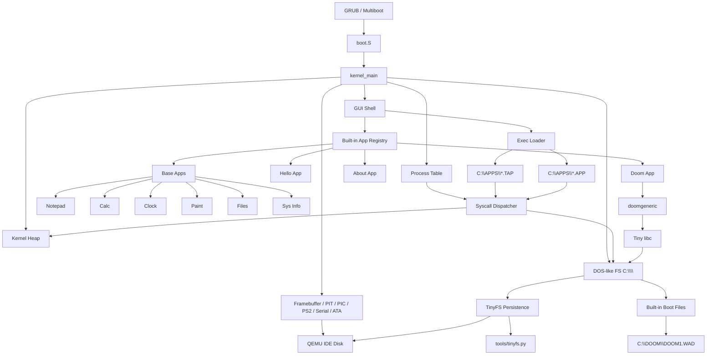

# TinyDoomOS Architecture

TinyDoomOS is moving from a Doom boot demo toward a small Windows 3.x-style
pet-project OS: graphical shell first, simple app model, cooperative execution,
then loadable apps.

## Goal

Build a small but usable hobby OS that can:

- boot in a VM on a Mac
- show a graphical desktop shell
- run multiple small apps over time
- expose a stable C API for apps
- load simple apps from the DOS-like `C:\` filesystem
- persist user-created files on an attached disk image
- keep the implementation understandable for experiments

This is intentionally closer to Windows 3.11 than to a modern NT-like OS. The
current native `.APP` MVP still runs in the kernel address space; user mode,
paging, and preemptive multitasking can come later.

## Current Layers



## Boot And Kernel

- `boot/` contains GRUB config and linker script.
- `kernel/boot.S` exposes a Multiboot header and enters `_start`.
- `kernel/entry.c` initializes the machine and starts the GUI shell.
- `kernel/interrupts.c`, `pic.c`, `timer.c`, `keyboard.c` provide basic IRQs.
- `kernel/disk.c` provides a small ATA PIO block driver for the QEMU IDE disk.
- `kernel/memory.c` owns the kernel heap.
- `kernel/fs.c` exposes the DOS-like `C:\` filesystem. Read-only boot files are
  embedded in the kernel, while user-created files can persist through TinyFS
  when a raw disk image is attached.
- `kernel/process.c`, `syscall.c`, and `exec.c` provide the first loadable app
  runtime.

## Graphics

The OS currently uses the Multiboot framebuffer requested from GRUB.

`kernel/framebuffer.c` is the lowest-level drawing layer:

- pixels
- rectangles
- text
- scaled text
- Doom frame blit

The next layer should become a real GUI toolkit:

- windows
- controls
- focus
- clipping
- dirty rectangles
- mouse cursor

## App Model

The app model now has three tracks. Built-in C modules are linked into the kernel:

```c
typedef app_result_t (*app_entry_t)(void);

typedef struct {
    const char *id;
    const char *title;
    const char *summary;
    app_entry_t entry;
    const char *exec_path;
} app_descriptor_t;
```

The second track is `.TAP`, a tiny text executable format stored under `C:\APPS`.
The loader creates a process descriptor, gives the program a private sandbox
heap, and executes commands through the syscall dispatcher.

The third track is `.APP`, a raw i386 image with an `APP1` header. The build
currently assembles `user_apps/native_hello.S`, converts it to a binary blob,
and exposes it as `C:\APPS\NATIVE.APP`. This is a native loader MVP, not a
protected user-mode process yet.

The GUI launcher combines built-in apps, embedded boot executables, and dynamic
disk-installed apps found by scanning `C:\APPS` for non-embedded `.TAP` and
`.APP` files.

The future app model should evolve in stages:

1. Built-in C apps linked with the kernel.
2. `C:\APPS` `.TAP` apps with syscalls and sandbox heaps.
3. `C:\APPS` raw i386 `.APP` apps with a fixed API table.
4. Disk-loaded ELF-like apps.
5. Native process-like apps with paging and user mode.

## GUI Shell

`kernel/gui.c` is currently a desktop launcher. It reads app descriptors from
the app registry and runs selected apps.

Target behavior:

- desktop background
- top bar
- app launcher
- launcher list scrolling
- file manager for `C:\`
- modal windows
- keyboard and mouse navigation
- return to shell after app exit

Doom is special because it owns the screen while running. Pressing `F10` requests
app exit and returns to the shell.

## Tiny libc

`libc/` exists so Doom and apps can use familiar C functions. It is intentionally
minimal and should stay small.

`fopen`, `fwrite`, `stat`, `mkdir`, `remove`, and `access` now go through the
DOS-like filesystem. The `NORMALUNIX` Doom build flag remains only as an
upstream doomgeneric compatibility switch; the OS file model is DOS-like
(`C:\...`), not UNIX-like.

## Memory And Processes

`kernel/memory.c` replaces the old bump allocator with a free-list heap:

- `kmalloc`
- `kfree`
- `krealloc`
- memory usage stats

`kernel/process.c` tracks loadable app runs with a PID, image mapping, private
sandbox heap, state, and exit code. `.TAP` programs are isolated by interpreter
boundary: they cannot execute arbitrary i386 instructions or touch kernel memory
directly. `.APP` programs are native i386 code and currently rely on convention:
they call the process API table, but hardware memory protection is still future
work.

Native process isolation with ring 3 and paging is still future work.

## Filesystem And Exec

The filesystem is a small DOS-like table mounted as `C:\`. It has two layers:

- read-only boot files embedded in the kernel image
- writable user files and directories, persisted through TinyFS when a raw disk
  image is attached

Without a disk image, the writable layer still works in RAM and is discarded on
reboot. With `make run-persistent`, QEMU attaches `build/tinydoom.img` as an IDE
disk. On first boot TinyDoomOS formats it; later boots mount it and load saved
files.

`tools/tinyfs.py` is the host-side image tool. The Makefile wraps it with
`fs-ls`, `fs-put`, `fs-get`, `fs-mkdir`, `fs-rm`, and `install-sample-apps`, so
new `.TAP` and `.APP` files can be copied into `build/tinydoom.img` without
rebuilding the kernel.

Current files include:

- `C:\README.TXT`
- `C:\SYSTEM\KERNEL.SYS`
- `C:\APPS\WELCOME.TAP`
- `C:\APPS\FILES.TAP`
- `C:\APPS\MEMORY.TAP`
- `C:\APPS\NATIVE.APP`
- `C:\DOOM\DOOM1.WAD`
- writable files created from `COMMAND`, for example `C:\TEMP\NOTE.TXT`
- disk-installed apps such as `C:\APPS\HELLODSK.TAP`

The built-in `FILES` app is the first GUI file manager. It uses the same `fs_*`
API as `COMMAND`: directory listing, folder creation, file deletion, text
viewing, and `exec_run_app` for `.TAP` and `.APP` files.

TinyFS is deliberately small: sector 0 stores a header, the next metadata
sectors store fixed-size file entries, and file data starts at LBA 16. It is not
FAT-compatible yet; it is a project-native format for learning and fast
iteration.

The `.TAP` format is a deliberately small script executable. Supported commands
include `PRINT`, `DIR`, `MEM`, `PROC`, `ALLOC`, `SLEEP`, `WAIT`, and `EXIT`.
Each command reaches the kernel through the syscall dispatcher.

The `.APP` format starts with:

- magic `APP1`
- entry offset
- image size
- flags

The native entry receives a tiny API table for write, memory info, process info,
sleep, directory listing, and exit.

## Roadmap

Milestone 1: Graphical Shell

- app registry
- Hello sample app
- base app suite
- About app
- GUI File Manager
- Doom app
- keyboard app launcher
- serial diagnostics

Milestone 2: GUI Toolkit

- windows
- labels
- buttons
- menus
- focus and keyboard events
- mouse cursor and PS/2 mouse driver

Milestone 3: Developer SDK

- `apps/hello.c` template
- app API header
- app lifecycle docs
- build rules for adding built-in apps

Milestone 4: Loadable Apps

- writable filesystem table
- `.TAP` executable loader
- raw i386 `.APP` loader
- syscall dispatcher
- process descriptors and private heaps
- ATA PIO disk driver
- TinyFS persistent disk image
- host-side TinyFS image tool
- dynamic `C:\APPS` launcher scan
- next: ELF-like app loading

Milestone 5: More OS Features

- native app ABI
- heap per native app
- cooperative scheduler
- shell task switcher
- paging and user mode
- FAT-like or FAT-compatible filesystem
